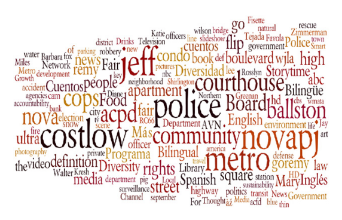
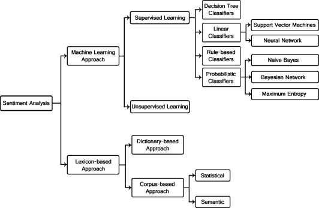
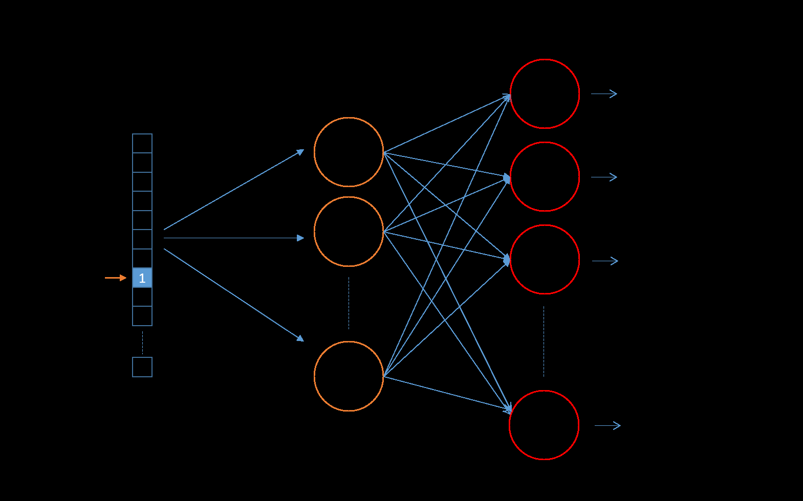
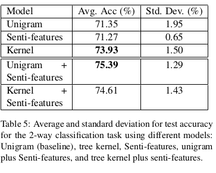

# Twitter Data Analysis

**Christian Braz**  
George Washington University — Department of Data Science

---

## Abstract

Today's Internet content is largely made from unstructured data, mostly images and text. Part of the text content is in the form of comments made by users giving their impressions about virtually everything. Processing natural language text documents is still a challenging task due to its ambiguity and context dependency. Nevertheless, being able to extract useful information from this source is highly desirable due to its market value. In this work, we evaluate the performance of machine learning and natural language processing techniques in the task of classifying sentiment in tweets.

**Keywords:** sentiment analysis, machine learning, natural language processing

---

## Introduction

Since its rise in the early 90s, the World Wide Web has been modifying the way people interact. Its distributed infrastructure, built upon Internet's top layers, made it pervasive and an ideal tool for all kinds of communication services. Social networks such as Facebook, Twitter, and Instagram are well-known interactive platforms that enable users to express their opinions.

Microblogging platforms have become highly successful as opinion promoters, and Twitter is their main representative. Users can publish opinions, discuss current issues, and express positive or negative sentiment. The value of such trend analysis goes beyond marketing. For instance, Kavanaugh et al. (2012) explore the use of Twitter, Facebook, Flickr, and YouTube to detect real-time spikes in activity related to public safety issues. Tools like the **tag cloud** help visualize the "big picture" of social media activity.

The purpose of this work is to evaluate **Support Vector Machines (SVM)** and **Maximum Entropy (MaxEnt)** for predicting positive or negative sentiment in tweets using word embeddings as features.

---

## Related Work

### Sentiment Analysis Methods

Sentiment Analysis (SA) — also known as Opinion Mining (OM) — automatically extracts knowledge from comments (Hemmatian & Sohrabi, 2017; Medhat et al., 2014). It is the process of extracting sentiments expressed by users in unstructured subjective texts and distinguishing their polarities. Sentiment analysis methods fall into two broad groups: **linguistic** and **machine learning** approaches.

#### Linguistic-Based Sentiment Classification

Words, phrases, and idioms used to express opinions are collectively called **opinion lexicon**. Each word has a polarity — positive, neutral, or negative — identified by studying its occurrence frequency in annotated corpora.

Two main strategies:

- **Dictionary-based:** Starts with a small set of seed opinion words, then iteratively grows the set by adding synonyms and antonyms.
- **Corpus-based:** Relies on syntactic patterns and a seed list of opinion adjectives, using linguistic constraints on connectives (AND, OR, BUT, ...) to identify additional opinion words.

#### Learning-Based Sentiment Classification

Learning-based approaches rely on conventional machine learning algorithms for text classification (Medhat et al., 2014). The **TF-IDF**[^1] scheme is widely used for feature engineering. Features extracted this way form a **bag-of-words (BOW)** representation. More recent strategies learn representations via **word vector semantics** — words in similar contexts tend to have similar meanings (Jurafsky & Martin, 2000).

[^1]: Term Frequency-Inverted Document Frequency

### Sentiment Classification of Twitter

Twitter key terminology (Agarwal et al., 2011):

- **Emoticons:** Facial expressions via punctuation and letters expressing the user's mood.
- **Target (`@`):** Refers to another user, alerting them automatically.
- **Hashtags (`#`):** Mark topics to increase tweet visibility.

Pang, Lee, and Vaithyanathan (2002) showed SVM with unigram features had the best performance for text classification. Go, Bhayani, and Liu (2009) used **distant supervision** (emoticon polarity) to label tweets, reporting SVM with unigrams at **71.35% accuracy**. Agarwal et al. (2011) reached 75.4% mixing unigram + senti-features. Arslan et al. (2018) reported ~85% using pre-trained word embeddings and a neural network — though with a flawed train/test methodology.

---

## The Experiment

The objective is to compare Maximum Entropy and SVM for predicting tweet sentiment using word vectors as features. The baseline is a Maximum Entropy model trained on unigram and bigram BOW features.

### Dataset

The final dataset is a concatenation of **five human-annotated datasets** (for training) plus:

- **Embedding corpus:** 1.6 million automatically labeled tweets from **Sentiment140** (Go et al., 2009) — used only for training the custom word embedding.
- **Classifier training:** Five manually annotated datasets, four from Saif et al. (2013) and one from Tromp & Pechenizkiy (2011).

### Overview of Manually Labeled Datasets

| Dataset | #tweets | #positives | #neutral | #negative |
|---|---|---|---|---|
| HCR | 2,516 | 541 | 470 | 1,381 |
| Sanders | 5,513 | 570 | 2,503 | 654 |
| SemEval | 34,183 | 15,543 | 6,440 | 12,290 |
| OMD | 3,238 | 710 | — | 1,196 |
| Tromp | 11,778 | 3,458 | 4,706 | 3,614 |
| **Total** | **57,228** | **20,732** | **14,119** | **19,135** |

Final balanced dataset: **40,000 examples** of binary human-labeled tweet sentiments.

### Feature Extraction

**Bag-of-Words (BOW):** Sparse vector of word counts weighted by TF-IDF:

$$\text{tf-idf}(t, d, D) = \text{tf}(t, d) \times \text{idf}(t)$$

$$\text{idf}(t) = \log \frac{n_d}{1 + \text{df}(d, t)}$$

**Word Semantic Vectors (Word2Vec / skip-gram with negative sampling):**

- Given an input word, a two-layer neural network is trained to predict nearby words. The hidden layer (300 neurons) becomes the word vector.
- **Subsampling** prunes very frequent words like "the" that add noise without useful context.
- **Negative sampling** updates only a small fraction of weights per training step, drastically reducing cost.

Custom embedding: **Gensim**, vector size 200, window 5 words.  
Pre-trained: **GloVe** 200-dim vectors trained on 2 billion tweets, 27 billion tokens, 1.2 million vocabulary (https://nlp.stanford.edu/projects/glove/).

### Classifiers

**Support Vector Machines (SVM):** Finds a maximum-margin hyperplane. Probability of opinion $s$ given comment $d$:

$$p(s \mid d) = \frac{1}{1 + e^{ah(d)+b}}$$

**Maximum Entropy (MaxEnt):**

$$P_{ME}(c \mid d, \lambda) = \frac{\exp \left[ \sum_i \lambda_i f_i(c, d) \right]}{\sum_{c'} \left[ \exp \sum_i \lambda_i f_i(c, d) \right]}$$

### Experimental Design

1. Logistic Regression baseline on unigram/bigram BOW.
2. Custom Word2Vec (200-dim, 5-word window, Gensim).
3. 5-fold cross-validation with custom Word2Vec.
4. 5-fold cross-validation with GloVe Word2Vec.

---

## Results

### Main Results (5-fold Cross-Validation)

| Algorithm | Feature | Accuracy | F1 |
|---|---|---|---|
| Logistic Regression | BOW | 0.726 | 0.775 |
| Logistic Regression | Custom Word2Vec | 0.762 | 0.820 |
| SVM (C=1, linear) | Custom Word2Vec | 0.767 | 0.823 |
| Logistic Regression | GloVe Word2Vec | 0.783 | 0.834 |
| **SVM (C=1, linear)** | **GloVe Word2Vec** | **0.783** | **0.834** |

Word vectors consistently outperform BOW. Results are comparable to Agarwal et al. (2011).

### SVM Kernel Comparison (Custom Word2Vec, C=1)

| Kernel | Accuracy |
|---|---|
| **Linear** | **0.767** |
| RBF | 0.726 |
| Polynomial | 0.651 |

### TF-IDF Weighting of Word Embeddings

| Algorithm | Feature | Accuracy | F1 |
|---|---|---|---|
| Logistic Regression | Custom Word2Vec + TF-IDF | 0.743 | 0.812 |
| SVM (C=1, linear) | Custom Word2Vec + TF-IDF | 0.747 | 0.813 |
| Logistic Regression | GloVe Word2Vec + TF-IDF | 0.757 | 0.821 |
| SVM (C=1, linear) | GloVe Word2Vec + TF-IDF | 0.758 | 0.822 |

Interestingly, TF-IDF weighting does **not** improve accuracy — it consistently degrades both metrics.

---

## Conclusion

Two machine learning algorithms were evaluated for tweet sentiment classification using word vectors as features, compared against BOW. Key findings:

- Word vectors consistently outperform BOW representations.
- TF-IDF weighting of embeddings does not improve and slightly hurts performance.
- Linear SVM and Logistic Regression perform nearly identically on the same features.

For future work: higher-dimensional word vectors, different/ensemble classifiers, and **Recurrent Neural Network** sequence models (state-of-the-art in many sequence-dependent tasks).

---

## References

Agarwal, A., Xie, B., Vovsha, I., Rambow, O., & Passonneau, R. (2011). Sentiment analysis of twitter data. In *Proceedings of the Workshop on Languages in Social Media* (pp. 30–38). ACL.

Arslan, Y., Küçük, D., & Birturk, A. (2018). Twitter sentiment analysis experiments using word embeddings on datasets of various scales. In *Natural Language Processing and Information Systems* (pp. 40–47). Springer.

Brzozowska, A. (2018). E-business as a new trend in the economy. *Procedia Computer Science, 65*, 1095–1104.

Go, A., Bhayani, R., & Liu, L. (2009). Twitter sentiment classification using distant supervision. *Technical Report, Stanford*.

Hemmatian, F., & Sohrabi, M. K. (2017). A survey on classification techniques for opinion mining and sentiment analysis. *Artificial Intelligence Review*. https://doi.org/10.1007/s10462-017-9599-6

Jurafsky, D., & Martin, J. H. (2000). *Speech and language processing* (1st ed.). Prentice Hall PTR.

Kanhere, S. (2011). Participatory sensing: Crowdsourcing data from mobile smartphones in urban spaces. In *ICMDM* (pp. 3–6).

Kavanaugh, A. L., et al. (2012). Social media use by government. *Government Information Quarterly, 29*(4), 480–491.

Liu, B., & Zhang, L. (2012). A survey of opinion mining and sentiment analysis. In *Mining Text Data* (pp. 415–463).

Medhat, W., Hassan, A., & Korashy, H. (2014). Sentiment analysis algorithms and applications. *Ain Shams Engineering Journal, 5*(4), 1093–1113.

Mikolov, T., Sutskever, I., Chen, K., Corrado, G., & Dean, J. (2013). Distributed representations of words and phrases. In *NeurIPS — Volume 2* (pp. 3111–3119).

Pang, B., Lee, L., & Vaithyanathan, S. (2002). Thumbs up? Sentiment classification using machine learning techniques. *CoRR, cs.CL/0205070*.

Saif, H., Fernández, M., He, Y., & Alani, H. (2013). Evaluation datasets for twitter sentiment analysis. In *ESSEM 2013*.

Tromp, E., & Pechenizkiy, M. (2011). Senticorr: Multilingual sentiment analysis. In *IEEE ICDMW* (pp. 1247–1250).
